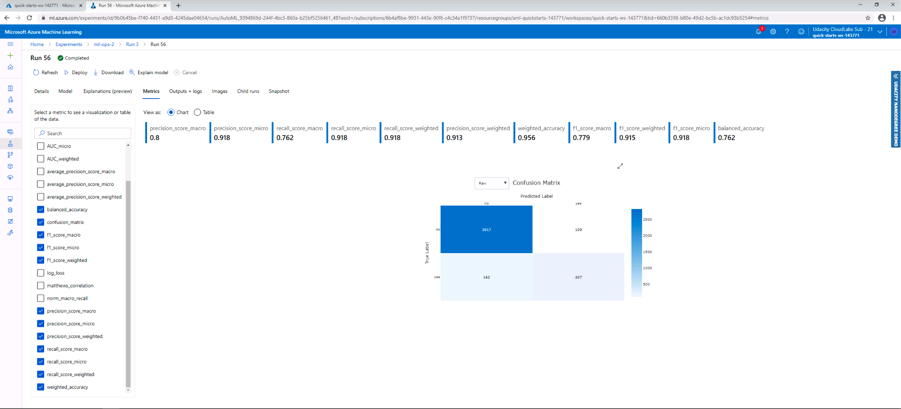
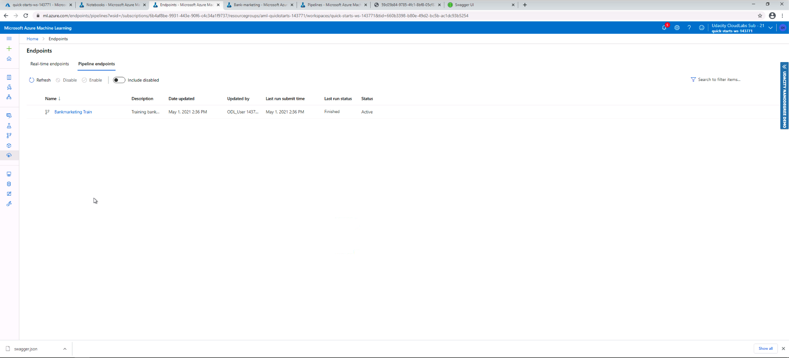

# Operationalizing Machine Learning with MS Azure
The is the second project of Udacity's Machine Learning Engineer with Microsoft Azure Nanodegree. 
*TODO:* Write an overview to your project. It uses Azure ML Studio to configure, deploy and consume a cloud-based machine learning production model. In a later step a ML pipeline is created, published, and consumed through a Juypter Notebook, running in Azure ML Studio. 

## Architectural Diagram
The following diagram displays the major steps taken in this project. 

1. Authentication: To interact with Azure Machine Learning Studio, the Azure ML Extension was needed. 
2. Automated ML Experiment: Create and run Auto ML Experiment through creating an experiment using Automated ML, configuring a compute cluster, and using that cluster to run the experiment.
3. Deploy the best model: To interact with the HTTP API service and interact with the model by sending data over POST requests. 
4. Enable logging: To monitor our deployed model, logging was enabled (Application Insights). It helps to know the number of requests it gets, the time each request takes, etc.
5. Swagger Documentation: Interact with the model endpoint through a graphical UI called Swagger.
6. Consume model endpoints: To do inference, the model endpoint was tested.  
7. Create and publish a pipeline: To configure and automate the pipeline, we use the Python SDK through Jupyter Notebook and create an AutoML run as well. 

## Key Steps
The following depicts the key steps taken in operationalizing the ml model(s). 
1. Authentication: I was using the lab environment and had therefore no need to install the Azure ML Extension and create the Service Principal account. However, I had to authenticate in a later step when enabling logging. 
2. Automated ML Experiment: 
    - After launching the Azure ML Studio, I found the already registered dataset [bank marketing dataset](dataset/bankmarketing_train.csv). 
    
    - I created a compute cluster called ml-ops-2 using a Standard_DS12_v2 VM and 1 as the minimum and maximum number of nodes. 
    - I created a new AutoML run with as a new experiment, gave it the label column "y" and configured it to start on my previously created compute cluster
    
    - since this is a classification problem, I selected the corresponding AutoML task type 
    
    - I configured additional settings to have the primary metric set to "Accuracy" and my exit training job time 1 hour and 5 concurrent iterations (Azure allows up to 100 concurrent iterations!)
    
    - I then started the run and waited...
    
    - ...exactly 1 hour for it to finish. Now it gets interesting: without ever writing a single line of code, we (aka Azure AutoML) with its best performing algorithm Voting Ensemble achieved an accuracy of 91.775% on our dataset! 
    
    - the following screenshot shows this again: 
    
    - The most interesting part can be found on the "Metrics" tab in this experiment. We can see different metrics for our model and we e.g. see that our weighted area under curve (AUC_weighted) has a staggering 94.4%! We see a graph plotting our precision-recall and further graphs
    
    - Now we can even select the metrics that we want to visualize. I was particularly interested in the confusion matrix and the resulting precision, recall and f1_score (a combination of both) since accuracy is not always the best metric to look at! 
    
3. Deploy the best model:
    - Since we are now convinced that our model is performing pretty good, it is time to deploy it. This can be done through a simple click on "Deploy". I gave it a name and a description and used Azure Container Instance as a compute type, where I will put the model into. I could now enable Application Insights diagnostics and data collection through a single click already, but this will be part of the next steps. Important: my container with the model endpoint should not be publicly available, so I enabled authentication. 
    
    - After a few minutes, my model is deployed! 
    
    - In the "endpoints" tab, I find my model endpoint and some relevant information such as Deployment state, REST endpoint, Swagger URI (more on that later) and the disabled Application Insights. 
    
4. Enable Logging: 
    - Enabling Application Insights and Logs could have been done at the time of deployment, but for this project we achieved it using Azure Python SDK. That meant az cli tool installed, SDK installed, virtual environment created, config.json downloaded and small code changes. Then run the logs.py file and interactively authenticate via Web Browser.
    
    
    - After enabling it via the cli, Application Insights is now enabled and and URL provided (see at the bottom). Success!
    
5. Swagger Documentation: 
    - To consume our best AutoML model using Swagger, I first needed to download the swagger.json file provided to us in the Endpoints section. Both swagger.sh and serve.py files are needed to be able to interact with the swagger instance running with the documentation for the HTTP API of the model. That meant starting both in seperate terminals and result was a template swagger UI running on localhost:9000.
    
    - Then I configured the swagger.sh to use my best model's documentation: 
    
    - We could now play with the endpoints of our model. We see a GET endpoint to check the health status and a POST endpoint to score a customer of the bank. 
    
6. Consume Model endpoints: 
    - Since the model is now deployed, we now use another provided script to interact with the trained model. I changed the values in the script for both the scoring_uri (our REST endpoint) and a key (for Authentication with a Bearer token). The following screenshots displays those values used and even gives the output of calling our endpoint with the python script. Success! Our model predicted a yes for the first person and a now for the second. 
    
    - (Optional) Benchmarking: What happens to our model, when we call the endpoints multiple times? Using Apache Benchmark, we load-test our deployed model. A provided script called benchmark.sh was used and the result is shown in the following screenshot. For example, it takes an average of 182 ms per request - that is pretty good! Especially if you know that Azure times out a request after a maximum of 60 sec! 
    
7. Create and publish a pipeline: 
    - For this step, I used the provided aml-pipelines-with-automated-machine-learning-step Jupyter Notebook to create a Pipeline inside the "Notebooks" tab in Azure ML Studio. A few values needed to be changed to match the current enviroment. The pipeline run was submitted directly within the Notebook. It completed successfully. 
    
    - The following steps shows the running pipeline: 
    
    - And the completed pipeline graph: 
    
    - That obvisously meant an experiment and the following screenshots displays all the experiments. 
    
    - To create an endpoint, the following code was responsible.
    
    - Resulting in another pipeline run. 
    
    - And an active pipeline endpoint, based on the bank marketing dataset.
    
    - The published pipeline is now active and we could call the REST endpoint. Success! 
    

## Screen Recording
https://youtu.be/WLtbem5b1dA

## Standout Suggestions
It is important to mention, that the dataset is very imbalanced, resulting in a negative impact on the model's accuracy. It is easy for the model to be very accurate just by predicting the majority class, while the accuracy for the minority class can fail miserably. This means that taking into account a simple metric like accuracy in order to judge how good our model is can be misleading. 
Possible techniques on how to deal with an inbalanced dataset are: 
- undersampling (select only some samples from the majority class), 
- oversampling (replicate data from the minority class)
- generate synthetic dataset (e.g. using SMOTE or K-nearest-neighbour)

Furthermore, that means changing the primary metric to combat the case of highly inbalanced data, another primary metric could be used like "recall". Recall is being used when the False Negatives are important.
